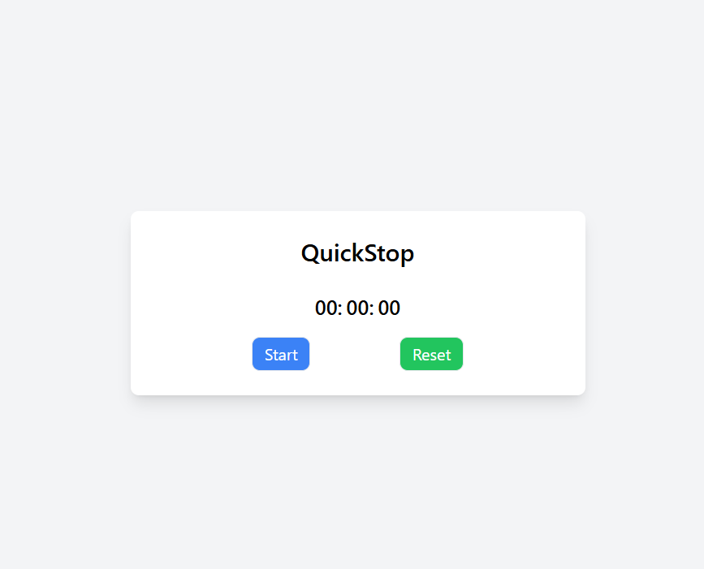

# QuickStop 

QuickStop is a simple and responsive stopwatch application built with React and Tailwind CSS. It allows users to start, stop, and reset the timer with a sleek and modern design.

## 🚀 Features

Start, Stop, and Reset functionality

Millisecond precision (updates every 10ms)

Fully responsive and centered UI

Styled with Tailwind CSS

Optimized for performance




## 🛠️ Technologies Used

1. React - Frontend framework

2. Tailwind CSS - Styling and layout

## 🏗️ Installation & Setup

##### Clone the repository:
```bash
git clone https://github.com/AsithaKanchana1/quickstop.git
cd quickstop
```
##### Install dependencies:

```bash
npm install
```
##### Start the development server:
```bash
npm run dev
```
## 🔧 Usage

1. Click Start to begin timing.

2. Click Stop to pause the stopwatch.

3. Click Reset to reset the timer back to zero.

## 🚀 Deployment

You can deploy this project using Vercel, Netlify, or GitHub Pages.

## 🤝 Contributing

Contributions are welcome! Feel free to fork the repository and submit a pull request.

### 📜 License

This project is licensed under the MIT License.

## 🌟 Show Your Support

If you like this project, please star this repository ⭐ and share it!
and Give me small donation [](https://www.buymeacoffee.com/asitha)

Made with ❤️ by [Asitha Kanchana Palliyaguru]